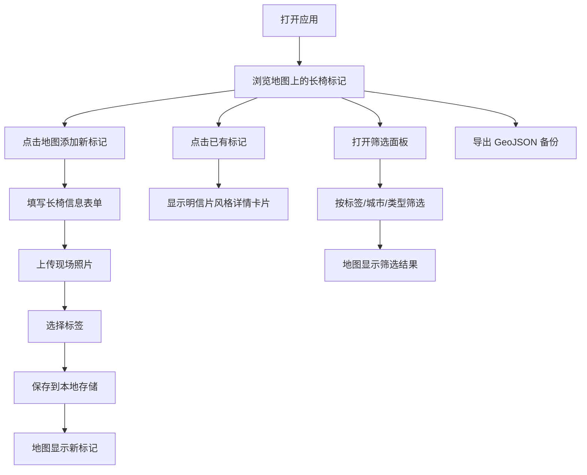

## 1. 产品概述

城市长椅地图是一款记录和分享城市中适合阅读、发呆、晒太阳的秘密长椅位置的前端应用。用户可以在地图上标记发现的优质长椅，记录详细信息和照片，通过标签筛选找到心仪的休憩地点，所有数据本地保存并支持导出备份。

- **核心价值**：帮助城市探索者发现和记录那些安静舒适的角落，让每个需要片刻宁静的人都能找到属于自己的城市秘密基地
- **目标用户**：城市漫游者、阅读爱好者、摄影爱好者、喜欢独处的人群

## 2. 核心功能

### 2.1 用户角色
无需注册登录，单用户本地使用。

### 2.2 功能模块
1. **地图主页**：交互式地图展示、长椅标记点、添加标记入口、筛选面板
2. **添加标记表单**：位置选择、基本信息录入、照片上传、标签选择
3. **明信片卡片**：长椅详情展示、照片轮播、标签展示
4. **数据管理**：本地存储、GeoJSON 导出、数据导入（可选）

### 2.3 页面详情

| 页面名称 | 模块名称 | 功能描述 |
|----------|----------|----------|
| 地图主页 | 顶部导航 | 应用标题、导出按钮、筛选按钮 |
| 地图主页 | 地图画布 | Leaflet 地图展示、长椅标记点、点击添加新标记 |
| 地图主页 | 筛选面板 | 按标签、城市、环境类型筛选标记点 |
| 添加表单 | 位置信息 | 显示经纬度、所在城市（自动识别） |
| 添加表单 | 基本信息 | 长椅名称、所在公园或街区、环境描述 |
| 添加表单 | 照片上传 | 支持上传1-3张现场照片，预览展示 |
| 添加表单 | 标签选择 | 预设标签：适合阅读、适合午睡、有夕阳、人少、有树荫 |
| 详情卡片 | 明信片展示 | 复古明信片风格、照片轮播、信息排版 |
| 详情卡片 | 操作按钮 | 编辑、删除标记 |

## 3. 核心流程

用户打开应用后看到地图，浏览已有的长椅标记。点击地图任意位置添加新标记，填写表单并上传照片后保存。点击已有标记查看明信片风格的详情卡片。通过筛选面板快速找到符合条件的长椅。可随时导出所有数据为 GeoJSON 格式备份。

## 4. 用户界面设计

### 4.1 设计风格

- **整体调性**：温暖治愈、文艺复古，如同旧时光里的旅行日记
- **主色调**：暖米色 `#F5F0E8`、橄榄绿 `#6B8E23`、夕阳橙 `#E8A87C`、深棕 `#4A4A4A`
- **点缀色**：复古红 `#C38D9E`、天空蓝 `#85DCBA`
- **字体**：标题使用 "Playfair Display" 衬线字体，正文使用 "Lora" 优雅衬线字体，营造文艺气息
- **按钮风格**：圆角 8px，轻微阴影，悬停时微微上浮并加深阴影
- **布局风格**：卡片式布局，注重留白和呼吸感，元素边缘带有微妙的纸质纹理
- **图标**：使用 Lucide 图标，线条柔和，与整体文艺风格协调

### 4.2 页面设计概览

| 页面名称 | 模块名称 | UI 元素 |
|----------|----------|----------|
| 地图主页 | 顶部导航 | 渐变背景、手写体标题、导出按钮带图标 |
| 地图主页 | 地图画布 | 暖色调地图样式、长椅图标为木质纹理风格 |
| 地图主页 | 筛选面板 | 侧边滑入、标签按钮为圆角胶囊样式 |
| 添加表单 | 表单容器 | 半透明磨砂玻璃效果、精致的输入框边框 |
| 添加表单 | 照片区域 | 拍立得风格的照片预览框 |
| 详情卡片 | 明信片容器 | 带锯齿边缘、邮戳装饰、手写字体点缀 |
| 详情卡片 | 照片轮播 | 轻微旋转角度模拟真实照片摆放 |

### 4.3 响应式设计

- 桌面端：地图全屏展示，侧边面板宽度 360px
- 平板端：自适应布局，面板宽度根据屏幕调整
- 移动端：筛选和表单改为底部弹出模态框，优化触摸交互

### 4.4 动效设计

- 页面加载：地图标记点逐个淡入并轻微弹跳
- 卡片弹出：从标记点位置平滑放大展开
- 筛选切换：标记点平滑过渡显示/隐藏
- 悬停效果：按钮和卡片微微上浮，阴影加深
- 照片轮播：平滑滑动过渡，带有轻微缩放效果
