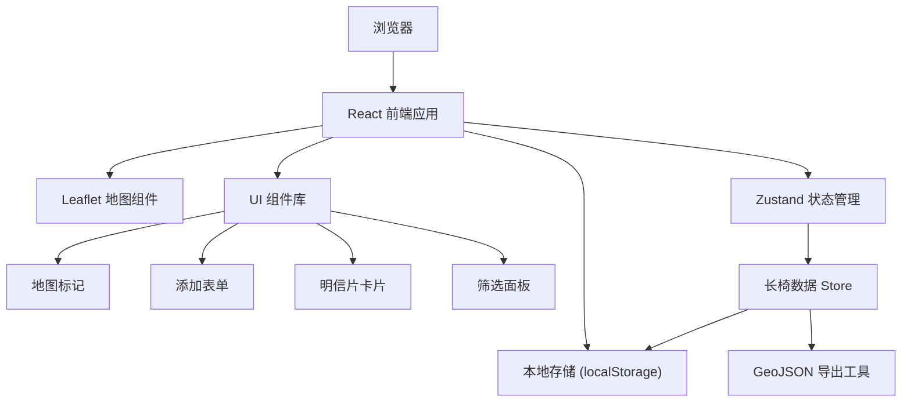
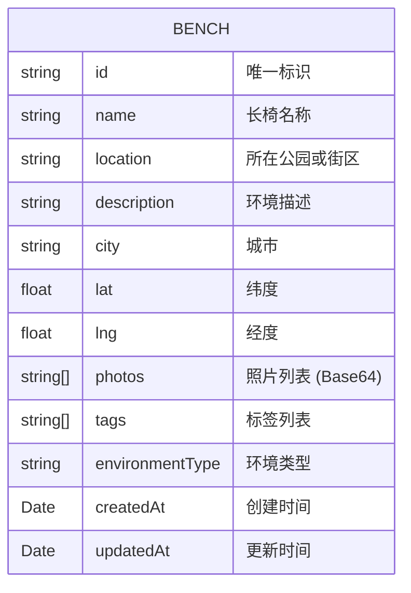

## 1. 架构设计



## 2. 技术描述

- **前端框架**：React 18 + TypeScript + Vite
- **地图库**：Leaflet 1.9 + react-leaflet
- **状态管理**：Zustand
- **样式方案**：Tailwind CSS 3
- **图标库**：Lucide React
- **数据存储**：localStorage（本地存储）
- **开发工具**：Vite 5

## 3. 目录结构

```
src/
├── components/
│   ├── Map/
│   │   ├── BenchMap.tsx          # 地图主组件
│   │   ├── BenchMarker.tsx       # 长椅标记组件
│   │   └── CustomTileLayer.tsx   # 自定义地图图层
│   ├── Form/
│   │   ├── AddBenchForm.tsx      # 添加长椅表单
│   │   ├── PhotoUploader.tsx     # 照片上传组件
│   │   └── TagSelector.tsx       # 标签选择器
│   ├── Card/
│   │   ├── PostcardCard.tsx      # 明信片风格卡片
│   │   └── PhotoCarousel.tsx     # 照片轮播
│   ├── Filter/
│   │   └── FilterPanel.tsx       # 筛选面板
│   └── Layout/
│       ├── Header.tsx            # 顶部导航
│       └── Modal.tsx             # 通用模态框
├── store/
│   └── useBenchStore.ts          # 长椅数据状态管理
├── types/
│   └── bench.ts                  # 类型定义
├── utils/
│   ├── storage.ts                # 本地存储工具
│   ├── geojson.ts                # GeoJSON 转换工具
│   └── geocoding.ts              # 地理编码工具
├── data/
│   └── mockData.ts               # 示例数据
├── App.tsx                       # 应用入口
└── index.css                     # 全局样式
```

## 4. 数据模型

### 4.1 数据模型定义



### 4.2 TypeScript 类型定义

```typescript
interface Bench {
  id: string;
  name: string;
  location: string;
  description: string;
  city: string;
  lat: number;
  lng: number;
  photos: string[];
  tags: BenchTag[];
  environmentType: EnvironmentType;
  createdAt: string;
  updatedAt: string;
}

type BenchTag = 
  | '适合阅读' 
  | '适合午睡' 
  | '有夕阳' 
  | '人少' 
  | '有树荫';

type EnvironmentType = 
  | '公园' 
  | '江边' 
  | '街角' 
  | '校园' 
  | '其他';

interface FilterState {
  tags: BenchTag[];
  city: string;
  environmentType: EnvironmentType | null;
}
```

### 4.3 GeoJSON 格式

```typescript
interface GeoJSONFeature {
  type: 'Feature';
  geometry: {
    type: 'Point';
    coordinates: [number, number];
  };
  properties: Omit<Bench, 'lat' | 'lng'>;
}

interface GeoJSONCollection {
  type: 'FeatureCollection';
  features: GeoJSONFeature[];
}
```

## 5. 状态管理设计

```typescript
interface BenchStore {
  benches: Bench[];
  filters: FilterState;
  selectedBench: Bench | null;
  isAdding: boolean;
  pendingLocation: { lat: number; lng: number } | null;
  
  // Actions
  addBench: (bench: Omit<Bench, 'id' | 'createdAt' | 'updatedAt'>) => void;
  updateBench: (id: string, updates: Partial<Bench>) => void;
  deleteBench: (id: string) => void;
  selectBench: (bench: Bench | null) => void;
  setAdding: (isAdding: boolean, location?: { lat: number; lng: number }) => void;
  setFilters: (filters: Partial<FilterState>) => void;
  exportGeoJSON: () => string;
  importGeoJSON: (geojson: string) => void;
  loadFromStorage: () => void;
}
```

## 6. 核心功能实现要点

### 6.1 地图交互
- 使用 `react-leaflet` 绑定地图事件
- 点击地图空白处触发添加标记流程
- 标记点使用自定义图标（长椅造型）
- 地图初始化时定位到用户所在城市或默认中心点

### 6.2 照片上传
- 使用 `FileReader` 将图片转换为 Base64 存储
- 限制最多 3 张照片，单张不超过 2MB
- 提供预览和删除功能
- 支持拖拽上传

### 6.3 本地存储
- 每次数据变更自动同步到 localStorage
- 应用启动时从 localStorage 加载数据
- 提供数据导入功能（从 GeoJSON 文件）

### 6.4 筛选逻辑
- 多条件筛选：标签（多选）、城市（下拉）、环境类型（单选）
- 标签筛选为「与」逻辑，需同时包含所有选中标签
- 地图标记平滑过渡显示/隐藏

## 7. 依赖版本

```json
{
  "react": "^18.2.0",
  "react-dom": "^18.2.0",
  "react-leaflet": "^4.2.1",
  "leaflet": "^1.9.4",
  "zustand": "^4.5.0",
  "lucide-react": "^0.344.0",
  "tailwindcss": "^3.4.1",
  "typescript": "^5.4.0",
  "vite": "^5.1.0"
}
```
